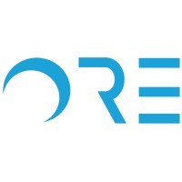

I am a student at the University of California, Berkeley pursuing a dual degree in Data Science (CDSS) and Applied Mathematics (L&S), with domain emphasis in Applied Mathematics & Modeling. Feel free to reach out to me at 
<a href="mailto:karora27@berkeley.edu" style="text-decoration: none; color: inherit; font-weight: 550;">karora27[at]berkeley.edu</a>.

Interests and Background
======

    My professional interests lie in software engineering, data engineering/analytics, and technology consulting. I hope to develop innovative tools used both in-house and in consumer-based markets, advancing technological innovation to benefit the world!

    My research interests lie in machine learning, human-computer interaction, and big data optimization. I advanced these interests during my tenure as a Lead Researcher in the <a href="https://www.ece.ucsb.edu/" style="text-decoration: none; color: inherit; font-weight: bold;">Department of Electrical and Computer Engineering</a> at UCSB, and also as a Machine Learning Intern for the startup <a href="https://www.ore.green/" style="text-decoration: none; color: inherit; font-weight: bold;">ORE</a>. Check out the projects section for more information 👀

    I’m currently working at <a href="https://gkadvisors.com/" style="text-decoration: none; color: inherit; font-weight: bold;">Global Key Advisors</a>, an advisory firm where I’m learning really interesting methods in natural language processing to analyze companies' 10-K reports in predicting their future performance.

    My prior work experience consists of being a technology analyst for <a href="https://qualcomm.com/" style="text-decoration: none; color: inherit; font-weight: bold;">Qualcomm</a> to help improve user traction for their online course offerings, merging my passion for software and UI/UX development with a more client-focused approach. Check out our development on the <a href="https://academy.qualcomm.com/" style="text-decoration: none; color: inherit; font-weight: bold;">Qualcomm Academy Website</a>!

