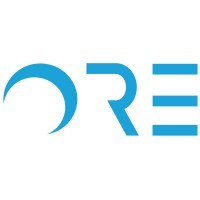

I am a student at the University of California, Berkeley pursuing a dual degree in Data Science (CDSS) and Applied Mathematics (L&S), with domain emphasis in Applied Mathematics & Modeling. I will be joining Amazon this summer as an incoming SDE intern within AWS. Feel free to reach out to me at 
<a href="mailto:karora27@berkeley.edu" style="text-decoration: none; color: inherit; font-weight: 550;">karora27[at]berkeley.edu</a>.

Interests and Background
======

    My professional interests lie in software engineering, data engineering/analytics, and engineering consulting. I hope to develop innovative tools used both in-house and in consumer-based markets, advancing technological innovation to benefit the world!

    My research interests lie in machine learning, human-computer interaction, and neural network optimization. I was able to explore these topics during my time as a lead researcher in the <a href="https://www.ece.ucsb.edu/" style="text-decoration: none; color: inherit; font-weight: bold;">Department of Electrical and Computer Engineering</a> at UCSB, and also as a Machine Learning Intern for the startup <a href="https://www.ore.green/" style="text-decoration: none; color: inherit; font-weight: bold;">ORE</a>. Check out the projects section for more information 👀

    I recently finished a contracted project <a href="https://gomomentus.com/" style="text-decoration: none; color: inherit; font-weight: bold;">Momentus Technologies</a>, an event management software company where I analyzed various revenue streams and customer satisfaction scores based on product feature usage, and provided data-backed visualizations through engineering linear regression models in how Momentus could enhance user engagement and drive client revenue growth. This past summer, I was working with <a href="https://gkadvisors.com/" style="text-decoration: none; color: inherit; font-weight: bold;">Global Key Advisors</a>, an advisory firm, as a qualitative analyst intern, where I learned and implemented some really interesting methods in natural language processing to analyze companies' 10-K reports through conducting sentiment analysis within their MD&A sectors and generating predictions on their future performance. 

Furthermore, I have worked as a technology analyst for <a href="https://qualcomm.com/" style="text-decoration: none; color: inherit; font-weight: bold;">Qualcomm</a> to help improve user traction for their online course offerings, merging my passion for software and UI/UX development with a more client-focused approach. Check out our development and recommendations on the <a href="https://academy.qualcomm.com/" style="text-decoration: none; color: inherit; font-weight: bold;">Qualcomm Academy Website</a>!

